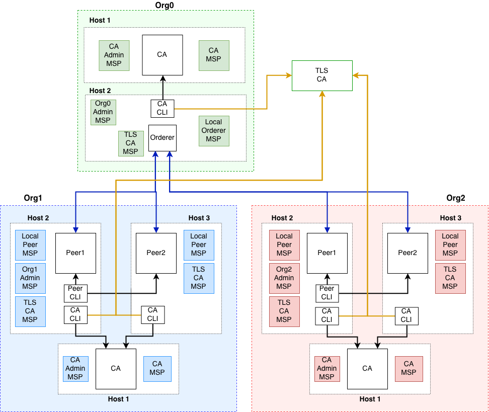

# Campus-Chain

* This newtork network consists of 3-Organisation and an IPFS Node.

* Organisation1 consists of 2 Peer Node and an Organisation CA. Out of 2 Peer Node only one is an Anchor Node and the other peer Node talks to the Anchor Node through Gossip Protocol to sync data.
* Orginastion2 is similar to Organisation1

* Orderer Organisation consists consists of 1 orderer organisation CA and 3 orderer nodes that implements Raft Protocol
* And A TLS CA for tls authentication.
  
 
## Campus-Chain Architecture 

 

## All the Cypto Materials are already genereated so that you don't have to generate it.Generating the crypto Materila will affect some configuration so its advised to skip crypto generation 

However if you still feel like generating the cypto Materials. You can do so using the following steps.

* Go to TLS-CA directory and run ./tlsCA-setup.sh. It will setup the TLS-CA for tls authentication.
* Go to org1 directory and run ./SETUP-ORG1.sh. It will generate cypto materials required for org1.
* Similary run ./SETUP-ORG2 and ./SETUP-ORG0.sh for generating the crypto Material


## For Bootstraping the Campus-Chain network 
* Go to cmd and run ./genesis.sh
* Next insdie cmd rund ./2nd.sh 

# For Generating Reprot run the bellow commadn
```
docker exec -e "CORE_PEER_MSPCONFIGPATH=/tmp/hyperledger/org1/admin/msp" -e "CORE_PEER_ADDRESS=peer1-org1:7051" cli-org1 peer chaincode query -C mychannel -n basic -c '{"Args":["GenrateReport","1816129"]}'
```

After running the above command you recive hash value of the report. Run the bellow command with the output hash value.(Replace the hash value with the output of genrate report)

```
docker exec ipfs_host ipfs cat bafyreibkgtfrdsxwvaean5niv6klvgoflzm74k6ntcuikyz5jgduzuk574 > someReportName.pdf
```

Since the report is in pdf format you will have to save it in pdf formt to be able to view it.


# For Starting Hyperledger Exploerer

 Go to blochain-explorer directory and run the bellow command 
  
  ```
  docker-compose -f explorer.yaml up
  ```
  You can view the Explorer ui here: localhost:8090


  ## Commands For cleaning the environment 

  docker rm -f $(docker ps -aq)
  docker volume prune
  docker network prune